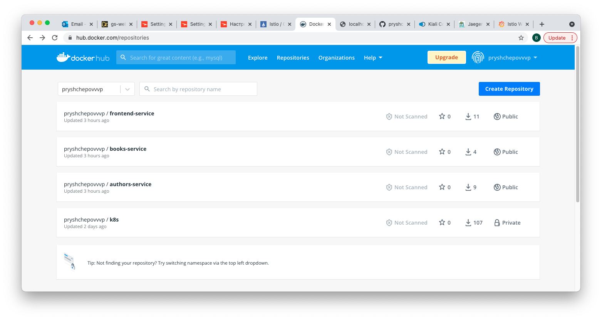
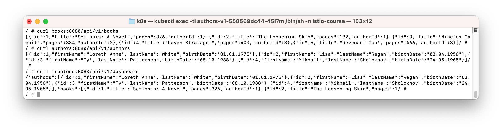
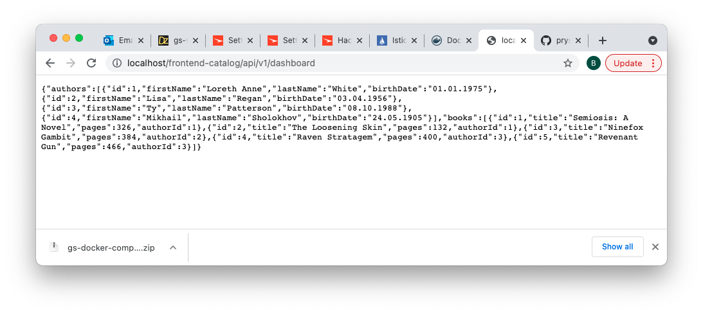
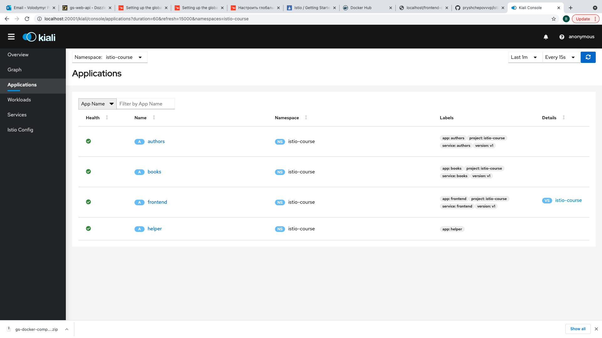
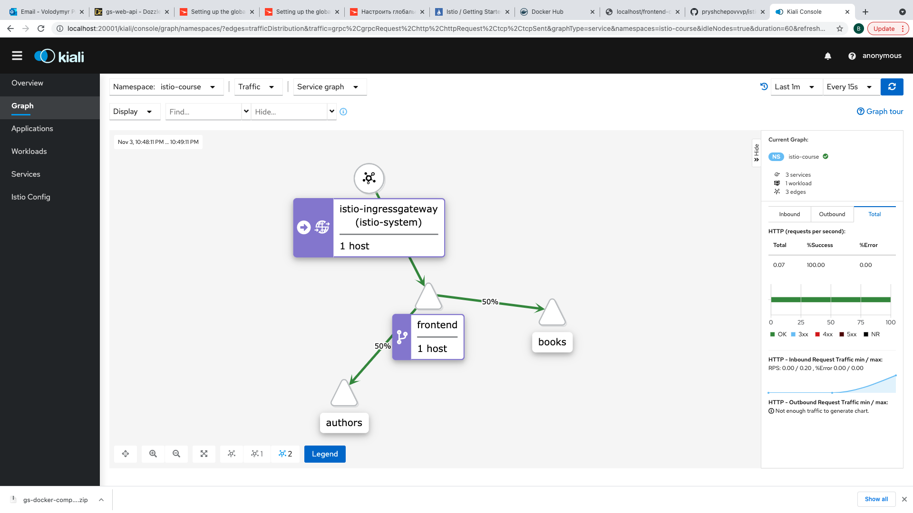
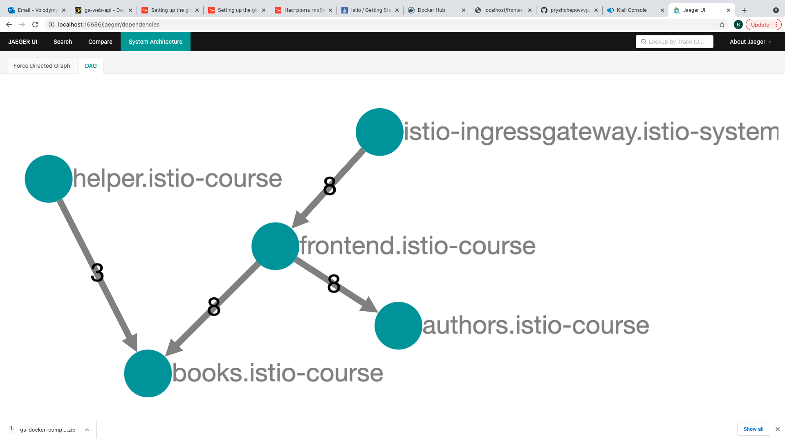
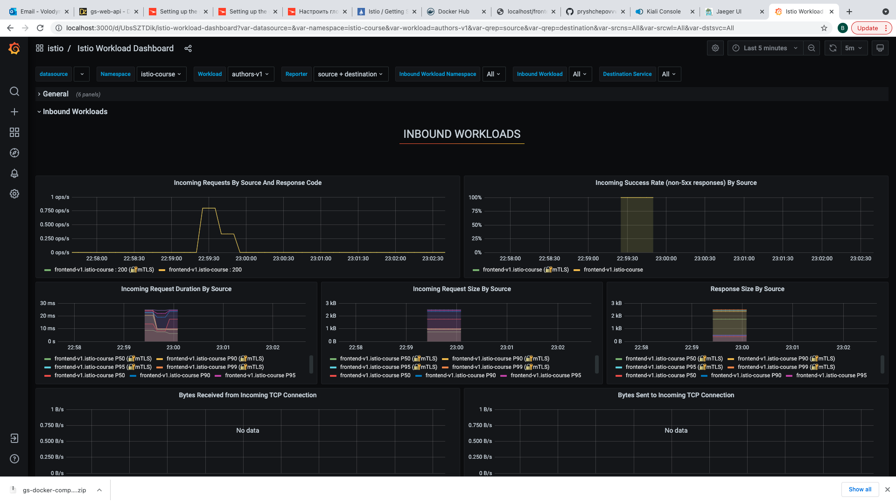
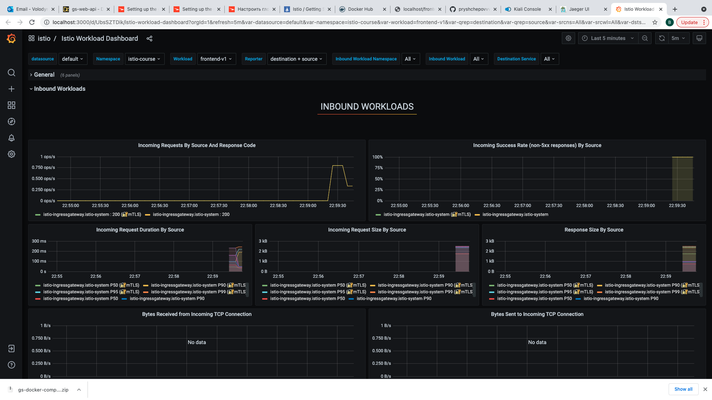

&nbsp;&nbsp;<h2>Lesson 2: Application deployment and telemetry data </h2> 
&nbsp;&nbsp;&nbsp;&nbsp;1,2. Install JDK11 &  Install a build tool maven  
&nbsp;&nbsp;&nbsp;&nbsp;&nbsp;&nbsp;1.1 brew install maven  
&nbsp;&nbsp;&nbsp;&nbsp;3. Build all services  
&nbsp;&nbsp;&nbsp;&nbsp;4. Publish application to your DockerHub repository  

&nbsp;&nbsp;&nbsp;&nbsp;5. Deploy application to  local Kubernetes  
&nbsp;&nbsp;&nbsp;&nbsp;&nbsp;&nbsp;5.1. Create namespace istio-course for deployment  
&nbsp;&nbsp;&nbsp;&nbsp;&nbsp;&nbsp;5.2. Make istio injection in this namespace  
&nbsp;&nbsp;&nbsp;&nbsp;&nbsp;&nbsp;&nbsp;&nbsp; kubectl label namespace istio-course istio-injection=enabled
&nbsp;&nbsp;&nbsp;&nbsp;&nbsp;&nbsp;5.3. Deploy all components  

&nbsp;&nbsp;&nbsp;&nbsp;6. Execute query in browser  

&nbsp;&nbsp;&nbsp;&nbsp;7. Open Kiali - istioctl dashboard kiali  

&nbsp;&nbsp;&nbsp;&nbsp;8. Open Jaeger - istioctl dashboard jaeger  

&nbsp;&nbsp;&nbsp;&nbsp;9. Open Grafana - istioctl dashboard grafana  

&nbsp;&nbsp;&nbsp;&nbsp;10. Learning  
&nbsp;&nbsp;&nbsp;&nbsp;&nbsp;&nbsp;- Istio telemetry https://istio.io/latest/docs/tasks/observability/  
&nbsp;&nbsp;&nbsp;&nbsp;&nbsp;&nbsp;- Istio monitoring https://istio.io/latest/docs/tasks/observability/metrics/using-istio-dashboard/  
&nbsp;&nbsp;&nbsp;&nbsp;&nbsp;&nbsp;- Kiali tool https://kiali.io/docs/architecture/architecture/  
&nbsp;&nbsp;&nbsp;&nbsp;&nbsp;&nbsp;- Open tracing https://opentracing.io/docs/overview/ 
