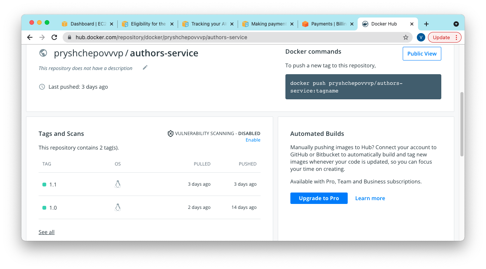

&nbsp;&nbsp;<h2>Lesson 3: Traffic management </h2> 
&nbsp;&nbsp;&nbsp;&nbsp;3.1. Change responce of the Author and Book service by adding version  
&nbsp;&nbsp;&nbsp;&nbsp;&nbsp;&nbsp;3.1.1. Adding version and nation to Author object, add new Authors - Mikhail Bulgakov and Reks Stout, build new image and push it in DockerHub  

&nbsp;&nbsp;&nbsp;&nbsp;&nbsp;&nbsp;3.1.2. Adding version and published to Book object, add new Books, build new image and push it in DockerHub  

&nbsp;&nbsp;&nbsp;&nbsp;3.2. Canary deployment  
&nbsp;&nbsp;&nbsp;&nbsp;&nbsp;&nbsp;3.2.1. Adding new deployments to K8S changing version and image to previous author and  book services  
&nbsp;&nbsp;&nbsp;&nbsp;&nbsp;&nbsp; - files 1.1.authors-v2.yml 2.1.book-v2.yml  