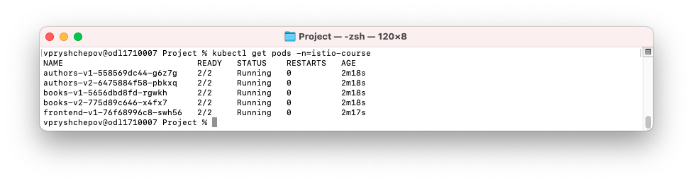
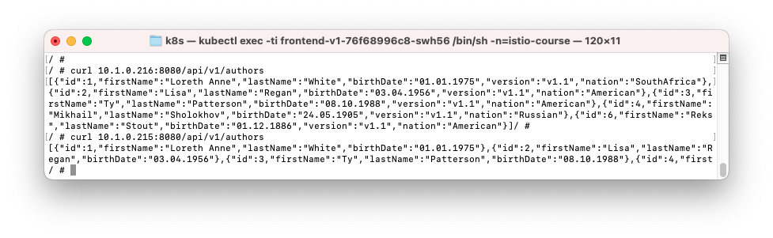
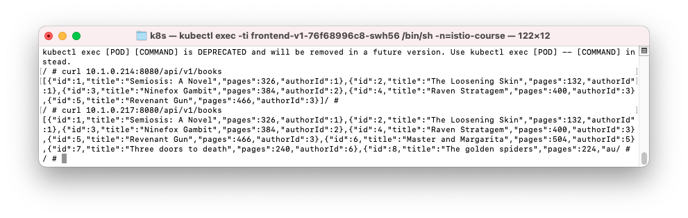
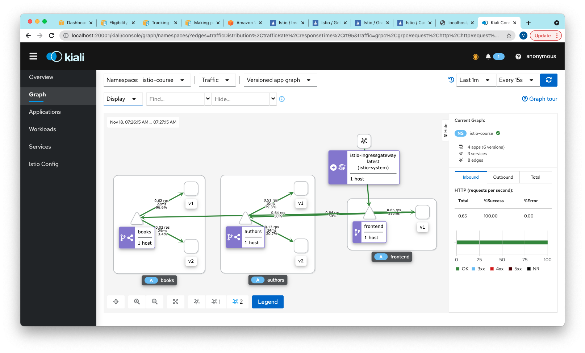
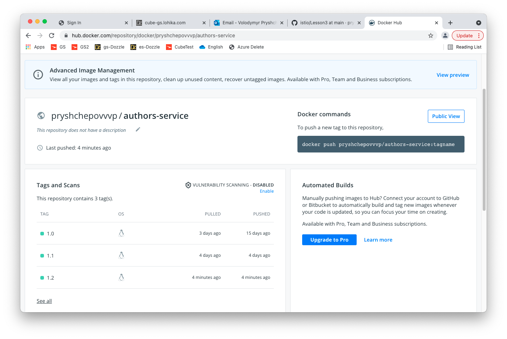
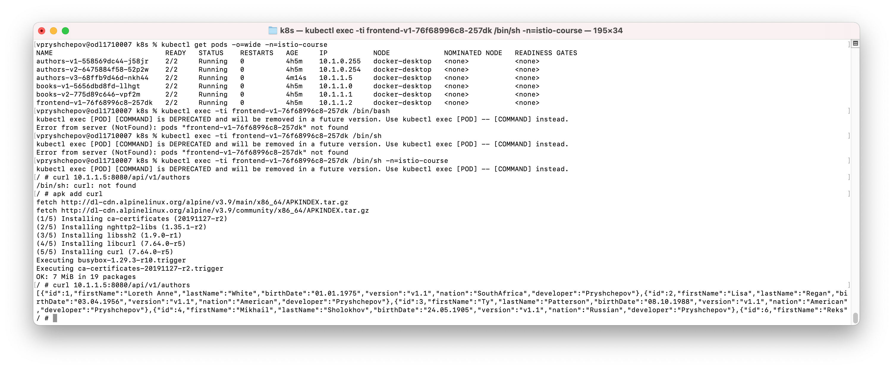
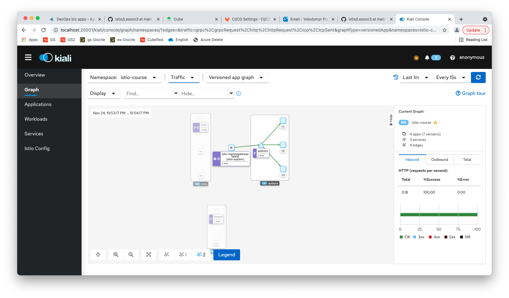
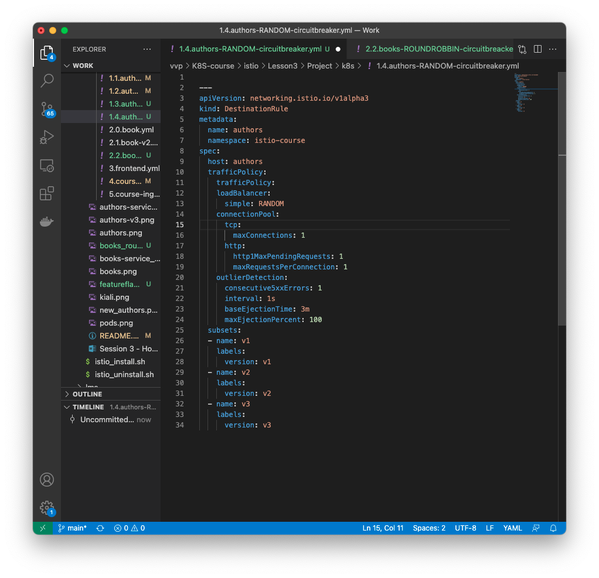
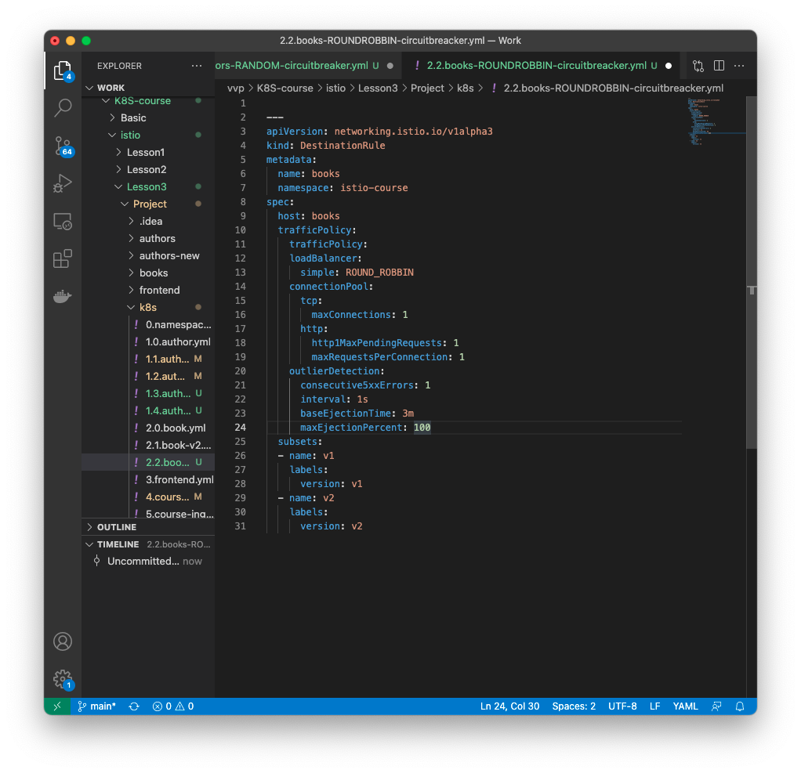

&nbsp;&nbsp;<h2>Lesson 3: Traffic management </h2> 
&nbsp;&nbsp;&nbsp;&nbsp;3.1. Change responce of the Author and Book service by adding version  
&nbsp;&nbsp;&nbsp;&nbsp;&nbsp;&nbsp;3.1.1. Adding version and nation to Author object, add new Authors - Mikhail Bulgakov and Reks Stout, build new image and push it in DockerHub  

&nbsp;&nbsp;&nbsp;&nbsp;&nbsp;&nbsp;3.1.2. Adding version and published to Book object, add new Books, build new image and push it in DockerHub  

&nbsp;&nbsp;&nbsp;&nbsp;3.2. Canary deployment  
&nbsp;&nbsp;&nbsp;&nbsp;&nbsp;&nbsp;3.2.1. Adding new deployments to K8S changing version and image to previous author and  book services  files 1.1.authors-v2.yml 2.1.book-v2.yml  

&nbsp;&nbsp;&nbsp;&nbsp;&nbsp;&nbsp;3.2.2. Create virtual sevice to route 10/90 50/50 and 90/10 between v2 and v1

&nbsp;&nbsp;&nbsp;&nbsp;3.3. Development environment  
&nbsp;&nbsp;&nbsp;&nbsp;&nbsp;&nbsp;3.3.1. Change service authors including Developer issue with "Pryshchepov" value to all authors build and push it to DockerHub as authors-service:1.2 

&nbsp;&nbsp;&nbsp;&nbsp;&nbsp;&nbsp;3.3.2. Create K8S deployment for new version changing in previous deployment image and version v3. Checking that v3 working properly by curl from frontend pod  

&nbsp;&nbsp;&nbsp;&nbsp;&nbsp;&nbsp;3.3.3. Create Virtual service to routes all incoming requests to v3 based on http header:developer:pryshchepov  It done by gateway side tuning service authors accessible from ingress, so in graph requests goes not from frontend service  

&nbsp;&nbsp;&nbsp;&nbsp;3.4. Service resiliency  
&nbsp;&nbsp;&nbsp;&nbsp;&nbsp;&nbsp;3.4.1. Create DestinationRule to load balance all incoming requests to the authors service by using RANDOM algorithm and circuit bracing 

&nbsp;&nbsp;&nbsp;&nbsp;&nbsp;&nbsp;3.4.2. Create DestinationRule to load balance all incoming requests to the books service by using ROUND_ROBBIN algorithm and circuit bracing  
