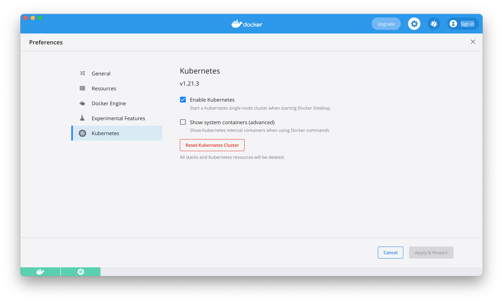

<B>It's a repository fo Istio course</b> 
Lesson 1: Setting up environment  
<nbsp><nbsp>1. Setup local K8S instance DockerDesktop for MacOS  
<nbsp><nbsp><nbsp><nbsp>brew install --cask docker  
<nbsp><nbsp><nbsp><nbsp>docker --version #to check task succefull  
<nbsp><nbsp><nbsp><nbsp>Open a docker desktop and enable Kubernetes
<nbsp><nbsp><nbsp><nbsp>

<nbsp><nbsp>2. Create DockerHub account if account doesn't exist yet
<nbsp><nbsp><nbsp><nbsp>

