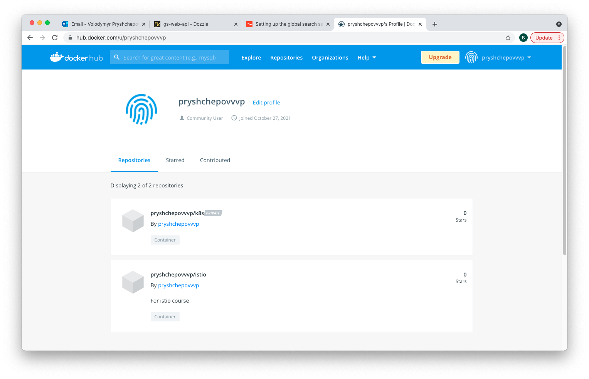

<B>It's a repository fo Istio course</b> 
  Lesson 1: Setting up environment  
    1. Setup local K8S instance DockerDesktop for MacOS  
       brew install --cask docker  
       docker --version #to check task succefull  
       Open a docker desktop and enable Kubernetes

    2. Create DockerHub account if account doesn't exist yet

