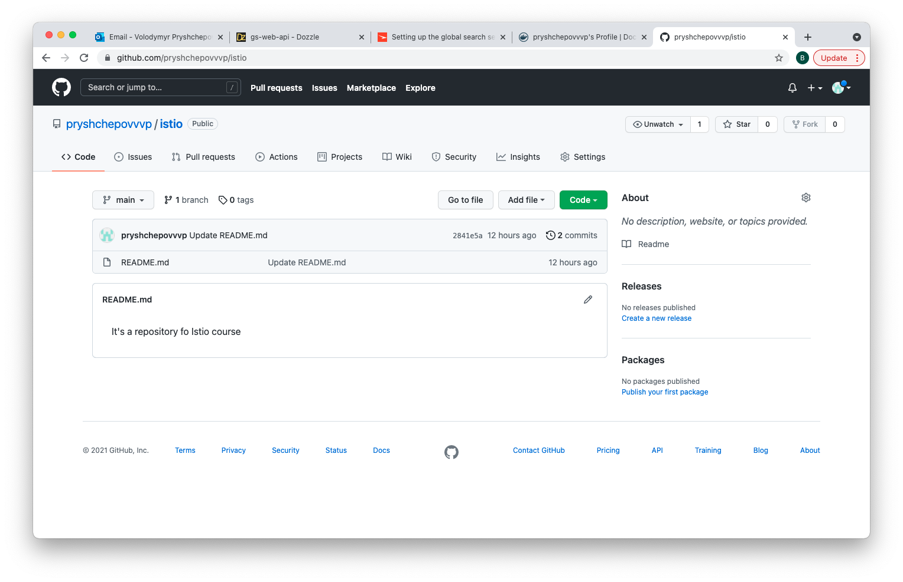

&nbsp;&nbsp;<h2>Lesson 1: Setting up environment </h2> 
&nbsp;&nbsp;&nbsp;&nbsp;1. Setup local K8S instance DockerDesktop for MacOS  
&nbsp;&nbsp;&nbsp;&nbsp;&nbsp;&nbsp;brew install --cask docker  
&nbsp;&nbsp;&nbsp;&nbsp;&nbsp;&nbsp;docker --version #to check task succefull  
&nbsp;&nbsp;&nbsp;&nbsp;&nbsp;&nbsp;Open  docker desktop and enable Kubernetes

&nbsp;&nbsp;2. Create DockerHub account if account doesn't exist yet

&nbsp;&nbsp;3. Create GitHub account if account doesn't exist yet

&nbsp;&nbsp;4. Install K9S tool https://k9scli.io
&nbsp;&nbsp;&nbsp;&nbsp;&nbsp;&nbsp;brew install derailed/k9s/k9s
